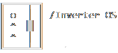

InverterOS - it's an ASCII OS that works on Batch and have a more functions!

Components:
<a src="https://www.win-rar.com/start.html?&L=4">WinRAR (Archivator)</a>
<a src="https://www.python.org/">Python</a>

Apps:
Opener (App Starter)
Gallery (Photo Viewer)
Music (Music Player)
Terminal (InverterOS Terminal)
File Manager (InverterOS File Manager)
OOBE (InverterOS Out Of Box Experience)

